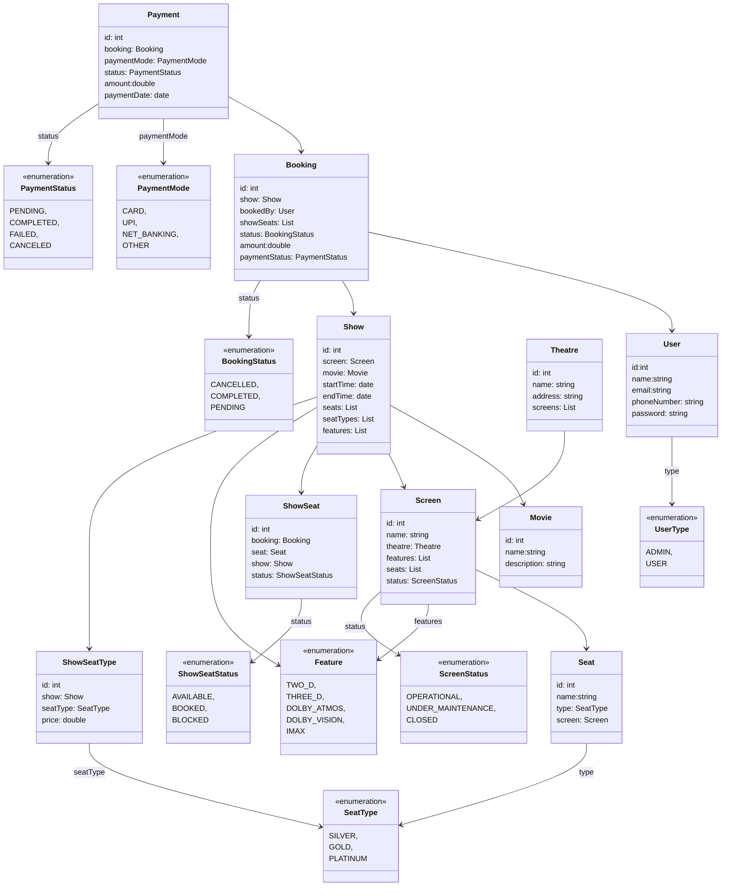

```mermaid
classDiagram

class User {
    id:int
    name:string
    email:string
    phoneNumber: string
    password: string
}

class Booking {
    id: int
    show: Show
    bookedBy: User
    showSeats: List<ShowSeat>
    status: BookingStatus
    amount:double
    paymentStatus: PaymentStatus
}

class Movie {
    id: int
    name:string
    description: string
}

class Payment {
    id: int
    booking: Booking
    paymentMode: PaymentMode
    status: PaymentStatus
    amount:double
    paymentDate: date
}

class Screen {
    id: int
    name: string
    theatre: Theatre
    features: List<Feature>
    seats: List<Seat>
    status: ScreenStatus
}

class Seat {
    id: int
    name:string
    type: SeatType
    screen: Screen
}

class Show {
    id: int
    screen: Screen
    movie: Movie
    startTime: date
    endTime: date
    seats: List<ShowSeat>
    seatTypes: List<ShowSeatType>
    features: List<Feature>
}

class ShowSeat {
    id: int
    booking: Booking
    seat: Seat
    show: Show
    status: ShowSeatStatus
 }
 
class ShowSeatType {
    id: int
    show: Show
    seatType: SeatType
    price: double
}

class Theatre {
    id: int
    name: string
    address: string
    screens: List<Screen>
}


class BookingStatus {
    <<enumeration>>
    CANCELLED,
    COMPLETED,
    PENDING
}

class Feature {
    <<enumeration>>
    TWO_D,
    THREE_D,
    DOLBY_ATMOS,
    DOLBY_VISION,
    IMAX
}

class PaymentMode {
    <<enumeration>>
    CARD,
    UPI,
    NET_BANKING,
    OTHER
}

class PaymentStatus {
    <<enumeration>>
    PENDING,
    COMPLETED,
    FAILED,
    CANCELED
}

class ScreenStatus {
    <<enumeration>>
    OPERATIONAL,
    UNDER_MAINTENANCE,
    CLOSED
}

class SeatType {
    <<enumeration>>
    SILVER,
    GOLD,
    PLATINUM
}

class ShowSeatStatus {
    <<enumeration>>
    AVAILABLE,
    BOOKED,
    BLOCKED
}

class UserType {
    <<enumeration>>
    ADMIN,
    USER
}

%% Associations

Theatre --> Screen
Screen --> Seat
Show --> Movie
Show --> Screen
Show --> ShowSeat
Show --> Feature
Show --> ShowSeatType

Booking --> User
Booking --> Show

Payment --> Booking
Booking --> BookingStatus: status

Payment --> PaymentMode: paymentMode
Payment --> PaymentStatus: status

Screen --> Feature: features
Screen --> ScreenStatus: status
Seat --> SeatType: type
ShowSeat --> ShowSeatStatus: status
ShowSeatType --> SeatType: seatType
User --> UserType: type


```
